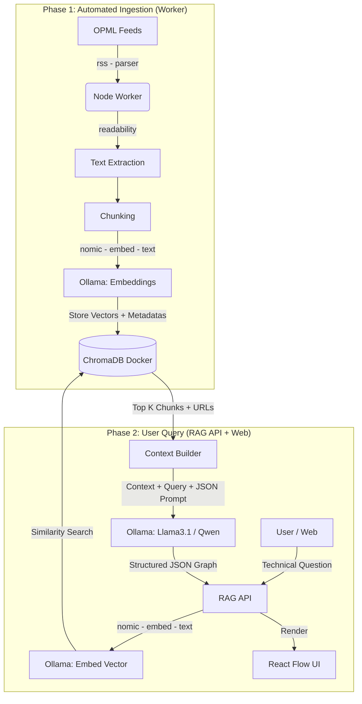

# Tech Plan and Detailed Architecture

## 1. Technology Stack (100% Local and Open-Source)

- **Base Ecosystem:** Monorepo managed with **Turborepo** (`turbo`), **pnpm** (>=10.24.0), and **Node.js** (>=22.0.0).
- **Infrastructure Management:** Docker and Docker Compose to run services.
- **Artificial Intelligence (Local):**
  - Engine: **Ollama** (leveraging the M3 Pro's 36GB unified memory).
  - Embeddings: `nomic-embed-text` (optimized for local retrieval).
  - Core LLM: `llama3.1:8b` (fast option) or `qwen2.5:32b` (high-capacity analytical option).
- **Vector Database:** **ChromaDB** (via Docker container).
- **Backend:** Node.js + TypeScript (FastAPI / Express / NestJS or Hono).
- **Frontend:** Next.js / React + **React Flow** (for graph visualization).
- **Key Node.js Libraries:** `rss-parser`, `@mozilla/readability`, `jsdom`, `chromadb`, `ollama` (official SDK).

## 2. Monorepo Structure (Turborepo)

We propose adapting the current structure of `../../package.json` into a workspaces format (`workspaces`):

```text
thenodewalk/
├── apps/
│   ├── worker-ingestion/    # Cronjob/Script to collect RSS into ChromaDB
│   ├── api-rag/             # Backend API that receives queries, searches the DB, and calls the LLM
│   └── web-client/          # User interface (React Flow)
├── packages/
│   ├── db-client/           # Centralized ChromaDB configuration
│   ├── ai-client/           # Prompts, LangChain/LlamaIndex, and Ollama SDK
│   └── types/               # Shared TypeScript types (e.g. JSON Graph interface)
├── docker-compose.yml       # Defines the ChromaDB container
└── package.json             # Root monorepo (containing the current scripts)
```

## 3. Vector Data Schema (ChromaDB)

When inserting parsed documents into ChromaDB, the TypeScript SDK will organize the data with the following logical mapping:

- **`ids`**: `hash(article_url + chunk_index)` -> Guarantees uniqueness and avoids duplicates on re-runs.
- **`embeddings`**: Numeric array generated by `nomic-embed-text`.
- **`documents`**: The cleaned technical article text (approx. 500 tokens).
- **`metadatas`** (JSON dictionary):
  - `blog_name` (String): E.g. "Netflix TechBlog"
  - `article_title` (String): E.g. "How Netflix scales its API"
  - `article_url` (String): Canonical URL, **vital for the graph nodes**.
  - `published_at` (String/ISO): Original publication date.
  - `chunk_index` (Int): Sequential order of the text within the article.

## 4. Graph Design and Prompt Engineering

The Backend endpoint (`apps/api-rag`) will send a system prompt to Ollama with a strict output instruction.

**Example JSON output schema (expected Zod/TypeScript Interface):**

```json
{
  "summary": "Natural-language summary for the user.",
  "graph": {
    "nodes": [
      {
        "id": "node_1",
        "label": "Micro-Frontends",
        "type": "concept",
        "source_url": "https://engineering.canva.com/..."
      }
    ],
    "edges": [
      {
        "source": "node_1",
        "target": "node_2",
        "relationship": "implemented using"
      }
    ]
  }
}
```

## 5. Architecture Diagram (Mermaid)



## 6. Recommended Implementation Phases

1. **Phase 0 - Infrastructure and Setup:** Update `docker-compose.yml` to include the official ChromaDB image.
   Make sure Ollama is installed on macOS and pull the models (`ollama run nomic-embed-text`,
   `ollama run llama3.1`).
2. **Phase 1 - The Ingestion Pipeline:** Develop `worker-ingestion`. Read the `.opml` file, parse the
   XML of a couple of blogs for testing, clean the HTML, extract embeddings, and store them in ChromaDB.
3. **Phase 2 - Search and Generation Engine:** Develop `api-rag`. Build the endpoint that converts text
   into a vector, searches ChromaDB, and sends the JSON-structuring _Prompt_ to Ollama.
4. **Phase 3 - Visualization:** Develop the front-end application. Connect the response JSON schema to the React Flow
   nodes and vertices. Make sure that clicking a node opens its `source_url`.
