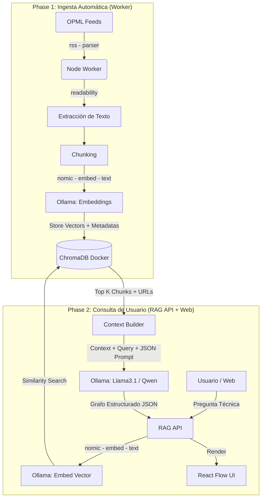

# Tech Plan y Arquitectura Detallada

## 1. Stack Tecnológico (100% Local y Open-Source)

* **Ecosistema Base:** Monorepo gestionado con **Turborepo** (`turbo`), **pnpm** (>=10.24.0) y **Node.js** (>=22.0.0).
* **Gestión de Infraestructura:** Docker y Docker Compose para levantar servicios.
* **Inteligencia Artificial (Local):**
  * Motor: **Ollama** (aprovechando la memoria unificada del M3 Pro de 36GB).
  * Embeddings: `nomic-embed-text` (Optimizado para recuperación local).
  * LLM Core: `llama3.1:8b` (Opción rápida) o `qwen2.5:32b` (Opción analítica de alta capacidad).
* **Base de Datos Vectorial:** **ChromaDB** (vía contenedor Docker).
* **Backend:** Node.js + TypeScript (FastAPI / Express / NestJS o Hono).
* **Frontend:** Next.js / React + **React Flow** (para visualización del grafo).
* **Librerías Clave Node.js:** `rss-parser`, `@mozilla/readability`, `jsdom`, `chromadb`, `ollama` (SDK oficial).

## 2. Estructura del Monorepo (Turborepo)

Se propone adaptar la estructura actual del `../../package.json` hacia un formato de espacios de trabajo (`workspaces`):

```text
thenodewalk/
├── apps/
│   ├── worker-ingestion/    # Cronjob/Script de recolección de RSS a ChromaDB
│   ├── api-rag/             # API Backend que recibe queries, busca en DB y llama al LLM
│   └── web-client/          # Interfaz de usuario (React Flow)
├── packages/
│   ├── db-client/           # Configuración centralizada de ChromaDB
│   ├── ai-client/           # Prompts, LangChain/LlamaIndex y SDK de Ollama
│   └── types/               # Tipados TypeScript compartidos (ej. Interfaz del Grafo JSON)
├── docker-compose.yml       # Define el contenedor de ChromaDB
└── package.json             # Root monorepo (el que contiene los scripts actuales)
```

## 3. Esquema de Datos Vectorial (ChromaDB)

Al insertar los documentos parseados en ChromaDB, el SDK de TypeScript organizará la data con el siguiente mapeo lógico:

* **`ids`**: `hash(article_url + chunk_index)` -> Garantiza unicidad y evita duplicados en re-ejecuciones.
* **`embeddings`**: Array numérico generado por `nomic-embed-text`.
* **`documents`**: El texto del artículo técnico depurado (aprox. 500 tokens).
* **`metadatas`** (Diccionario JSON):
  * `blog_name` (String): Ej. "Netflix TechBlog"
  * `article_title` (String): Ej. "How Netflix scales its API"
  * `article_url` (String): URL canónica, **vital para los nodos del grafo**.
  * `published_at` (String/ISO): Fecha de publicación original.
  * `chunk_index` (Int): Orden secuencial del texto dentro del artículo.

## 4. Diseño del Grafo y Prompt Engineering

El endpoint del Backend (`apps/api-rag`) enviará un prompt del sistema a Ollama con una instrucción estricta de salida.

**Ejemplo de esquema de salida JSON (Zod/TypeScript Interface esperado):**

```json
{
  "summary": "Resumen en texto natural para el usuario.",
  "graph": {
    "nodes": [
      {
        "id": "node_1",
        "label": "Micro-Frontends",
        "type": "concept",
        "source_url": "https://engineering.canva.com/..."
      }
    ],
    "edges": [
      {
        "source": "node_1",
        "target": "node_2",
        "relationship": "implementado usando"
      }
    ]
  }
}
```

## 5. Diagrama de Arquitectura (Mermaid)



## 6. Fases de Implementación Recomendadas

1. **Fase 0 - Infraestructura y Setup:** Actualizar el `docker-compose.yml` para incluir la imagen oficial de ChromaDB.
   Asegurarse de tener Ollama instalado en macOS y descargar los modelos (`ollama run nomic-embed-text`,
   `ollama run llama3.1`).
2. **Fase 1 - El Pipeline de Ingesta:** Desarrollar el `worker-ingestion`. Leer el fichero `.opml`, hacer parsing de los
   XMLs de un par de blogs para testear, limpiar el HTML, extraer embeddings, y guardarlos en ChromaDB.
3. **Fase 2 - Motor de Búsqueda y Generación:** Desarrollar el `api-rag`. Construir el endpoint que convierte el texto
   en vector, busca en ChromaDB, y envía el *Prompt* de estructuración JSON a Ollama.
4. **Fase 3 - Visualización:** Desarrollar la aplicación front-end. Conectar el esquema JSON de respuesta a los nodos y
   vértices de React Flow. Asegurarse de que al hacer clic en un nodo se abra la `source_url`.
